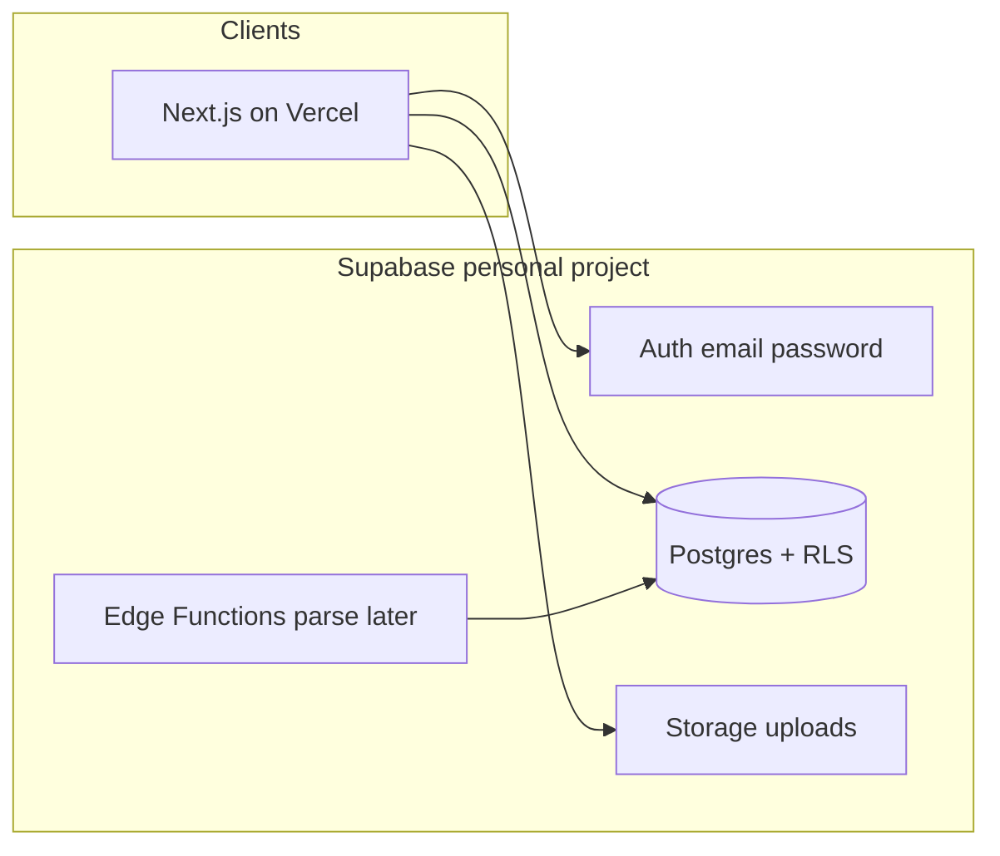

# Cami's Meal Planner — Build Plan

## Ownership guardrails (non-negotiable)

- **GitHub:** `siant279` only. Before any `gh`/`git push`, re-auth: `gh auth login` → switch active user to `siant279` → verify with `gh api user --jq .login` equals `siant279`. Never use `sianlandscapeul`.
- **Supabase / Vercel:** create projects while logged into **personal** dashboards only. Double-check org/account name in the UI before creating anything.
- **Repo contents:** KEIC PDFs/PNGs stay on disk for reference; add them to `.gitignore`. Commit seed data (`recipes.json`), schema, and app code—not cookbook binaries.

## Architecture (recommended)

Stick with the spec stack; refine a few schema and app choices for a two-person household.

| Layer | Choice | Why |
|-------|--------|-----|
| App | **Next.js App Router** + TypeScript | Spec default; good Supabase SSR auth story; deploys cleanly to Vercel |
| Backend | **Supabase** (Postgres, Auth, Storage) | Matches [`schema.sql`](schema.sql); shared data via RLS `authenticated` |
| Hosting | **Vercel** (personal) | Pair with Next.js; env vars for Supabase URL/keys |
| Parsing (later) | Supabase Edge Function + Claude API | Keep secrets server-side; submissions stay draft until approve |

**Schema tweaks vs current [`schema.sql`](schema.sql):**

1. Enable `pg_trgm` (schema already indexes `title` with `gin_trgm_ops` but only creates `pgcrypto`).
2. **Meal plan uniqueness:** change to `unique (plan_date, meal_type)` so each day/slot has one recipe (simpler UX). Drop the current `unique (plan_date, meal_type, recipe_id)` which allows duplicates per slot.
3. Add a small `profiles` table optional later; **not needed for MVP**—two Auth users + RLS on `authenticated` is enough.
4. Seed script: map numeric `id` from [`recipes.json`](recipes.json) away (DB uses UUIDs); keep title/source/etc. as-is. Fix obvious broken ingredient line-splits during seed if cheap.

**App structure (high level):**

- `app/(auth)/login` — email/password for two household accounts
- `app/(app)/today` — date-seeded picks (`dayHash` from [`extract/keic_planner.html`](extract/keic_planner.html))
- `app/(app)/browse` — filters + search
- `app/(app)/plan` — shared plan by date/slot
- `app/(app)/shop` — shared checklist + generate-from-plan
- `app/(app)/add` + `review` — Phase 2
- `lib/supabase/` — browser + server clients
- `supabase/migrations/` — versioned SQL from schema + tweaks
- `scripts/seed-recipes.ts` — load `recipes.json`

**Out of MVP:** Gmail label sync, Google Drive watch, multi-tenant orgs, admin roles.

## Phased build

### Phase 0 — Repo + cloud projects (setup only)

1. `gh auth login` as `siant279`; confirm login.
2. `git init` in this folder; `.gitignore` for PDFs/PNGs, `.env*`, `node_modules`, `.DS_Store`, duplicate `* 2.pdf` junk.
3. Create private GitHub repo under **`siant279`** (e.g. `camis-meal-planner`); push initial handoff files (spec, schema, recipes.json, extract scripts/HTML—not PDFs).
4. Create **personal** Supabase project; apply migrations; create two Auth users (you + husband).
5. Create **personal** Vercel project linked to that repo; set `NEXT_PUBLIC_SUPABASE_URL`, `NEXT_PUBLIC_SUPABASE_ANON_KEY`, and server-only keys as needed.

### Phase 1 — Core shared planner (ship this first)

Parity with the static prototype, but backed by Supabase:

- Auth gate (must be logged in)
- Today's Picks (deterministic rotation + shuffle + add to plan)
- Browse/search + choking-hazard badges (informational, not blocking)
- My Plan (date + meal_type → recipe)
- Shopping list (manual + generate/dedupe from plan)

No LLM yet. Seed all 177 recipes on first deploy.

### Phase 2 — Add recipe + review queue

- URL / paste-text / file upload → `recipe_submissions`
- Edge Function (or Route Handler) calls Claude → `parsed_recipe`
- Review UI: Approve → insert `recipes` / Edit / Reject
- Storage bucket for uploads

### Phase 3 — Background ingestion (optional)

- Gmail “Recipe Inbox” poller and/or Drive folder watcher writing the same `recipe_submissions` rows

## Design note

Reuse the prototype’s practical UX (meal tags, hazard chips, simple tabs) but give the real app a clear branded look (expressive type, warm food atmosphere)—avoid generic dashboard chrome. First viewport: product name + today’s picks, not a dense control panel.

## Verification checklist (before calling setup “done”)

- `gh api user` → `siant279`
- Git remote → `github.com/siant279/...` (not landscapeul)
- Supabase dashboard account is personal; Vercel team/account is personal
- PDFs absent from `git ls-files`
- Two users can both see the same plan/shopping list after login
